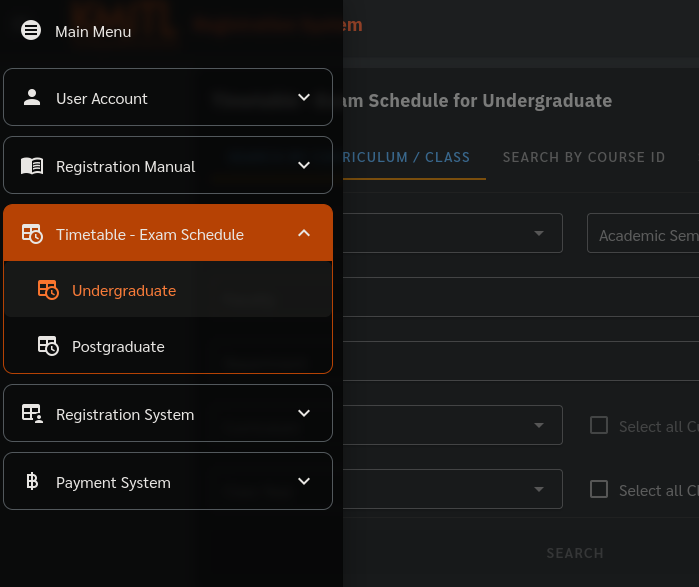
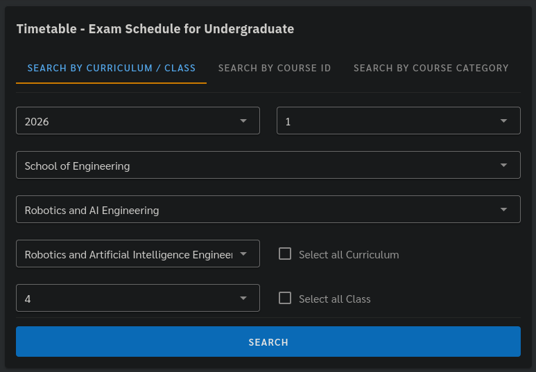
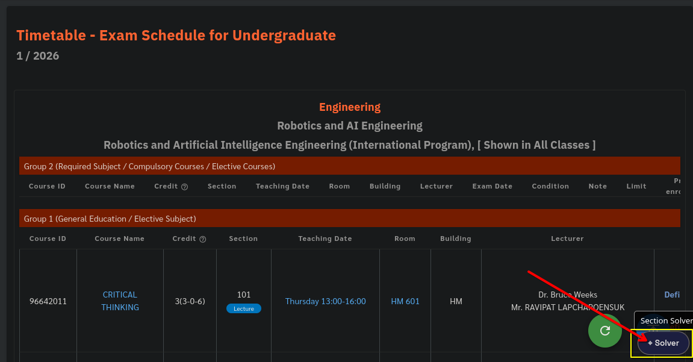
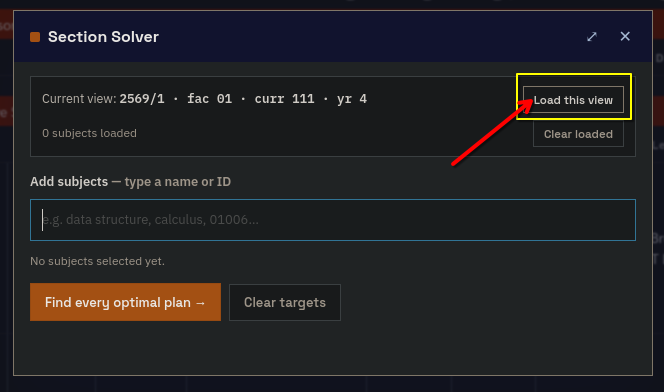
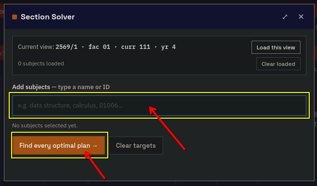
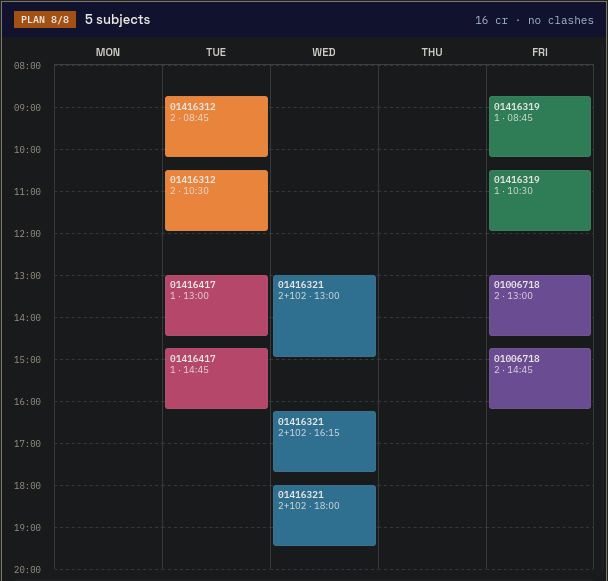
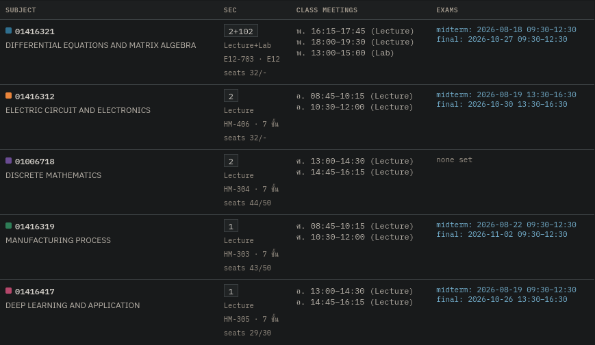

# What Is this?
This extension is a section registration / collision checker written by Claude code.

# How to install
1. Download userscript manager Chrome / Firefox extension (ex: TamperMonkey).
2. Click the [install link here](https://github.com/TanawatJukmongkol/KMITL-Conflict-Check/raw/refs/heads/main/conflict-check.user.js)

# How to use
## 1. Select your curriculum like normal

## 2. Click on the solver button

## 3. Load the subjects, and type in the subjects you want to register.

## Example results

# DISCLAIMER
THIS PROGRAM COMES WITH ABSOLUTELY NO WARRENTY. USE WITH CAUTION.

# PRIVACY NOTICE
THIS PROGRAM DOES NOT COLLECT ANY INFORMATION. IT IS YOURS TO USE / MODIFY / REDISTRIBUTE, UNDER THE MIT LICENSE.